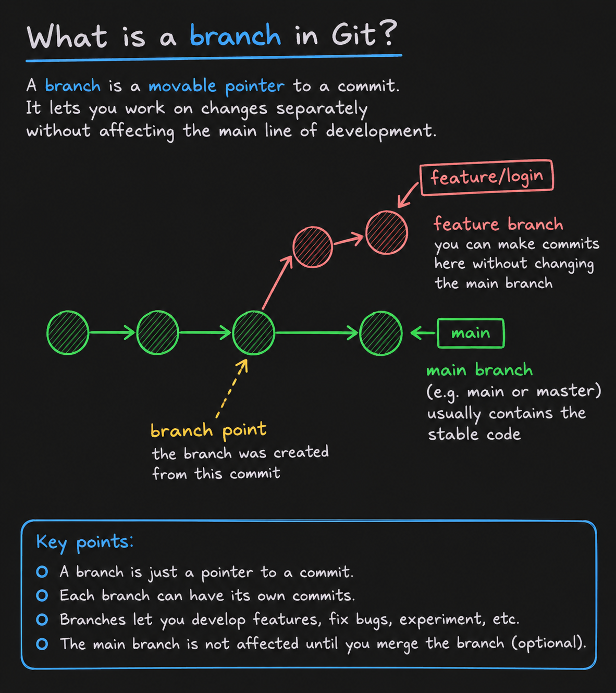
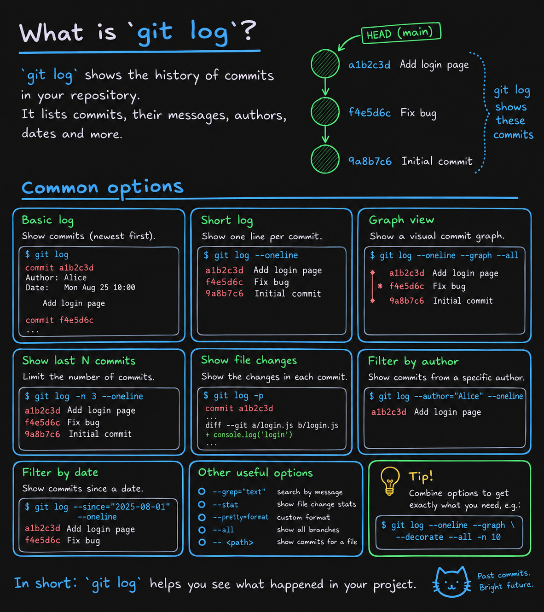

### Git hash contains:

* The commit message
* The author's name and email
* The date and time
* Parent (previous) commit hashes

> Hash = `SHA`

## Plumbing

All the data in a Git repository is stored directly in the (hidden) `.git` directory. That includes all the commits, branches, tags, and other objects.

Git is made up of objects that are stored in the `.git/objects` directory. A commit is just a type of object.

## Trees and Blobs

`tree`: git's way of storing a directory
`blob`: git's way of storing a file

```bash
git cat-file -p <hash of tree or blob>
```

Example: `git cat-file -p 5b21d4f16a4b07a6cde5a3242187f6a5a68b060f`


## Config

`git config remove-section webflyx` removes section (local)

`git config --list --local` shows local config only

`git config unset --all webflyx.ceo` removes keys with same name

`git config --list` shows global

`git config set --append webflyx.ceo` adds a key with same name, but different value

`git config unset --local webflyx` gives error

`git config unset --local webflyx.cto` removes key

`git config get webflyx.ceo` show key's value

`git config set --local webflyx.cto "TheLaneagen"` creates or updates key's value

## Branches



### Commands

Rename:
```bash
git branch -m "old_name" "new_name"
```

New branch:
```bash
git branch "branch_name"
# or
git switch -c "branch_name" # creates and switches to new branch 
```

The `switch` command allows to switch branches. Including the `-c` flag tells Git to create a new branch and switch to it.

`git checkout` is an old way!

## Git log



Commands:

```bash
git log --decorate=no
git log --decorate=full
git log --decorate=short # default

git log --oneline 
git log --oneline --graph --all # ASCII representation of the history
```

Links:

* [git log --graph docs](https://git-scm.com/docs/git-log#Documentation/git-log.txt---graph)
* [git log --all docs](https://git-scm.com/docs/git-log#Documentation/git-log.txt---all)
